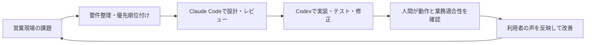

# CRM-Pro Showcase

**営業現場の課題を、要件整理から運用後の改善までつなぐ社内顧客管理・案件管理ツール。**

CRM-Proは、営業担当者として日々の業務で感じていた「顧客情報が分散する」「案件の進捗や次の対応が見えにくい」「追客が担当者任せになる」といった課題を解消するために企画・開発している社内向けツールです。現場の業務を理解し、必要な機能を整理し、利用者の反応をもとに改善するところまで継続して取り組んでいます。

このリポジトリは、CRM-Proの取り組みと開発の考え方を採用選考向けに紹介するショーケースです。**本番リポジトリのソースコード、実データ、社内資料は含みません。**掲載しているTypeScriptの例は、公開用に新しく作成した汎用サンプルです。

## 取り組みの概要

CRM-Proでは、営業現場で実際に使うことを前提に、顧客情報と案件状況を把握し、次の対応につなげる仕組みを整えています。機能を作ること自体ではなく、業務のどこで迷いや抜け漏れが起きるのかを見極め、運用に乗る形へ落とし込むことを重視しています。

- 営業現場の課題や利用者の要望を整理
- 必要な情報・画面・業務の流れを設計
- React / TypeScript / Supabaseを用いて開発
- 実際の利用状況やフィードバックを踏まえて改善

## 技術構成

- **フロントエンド:** React、TypeScript
- **バックエンド基盤:** Supabase
- **開発:** Claude Code、Codexを活用したAI駆動開発

本番環境の構成や業務固有のデータ設計は公開していません。技術名はプロジェクトの構成を示す範囲で記載しています。

## AIを活用した開発フロー

AIに作業を丸投げするのではなく、業務理解と仕様の判断を人が担い、ツールごとの得意な作業を組み合わせています。

| 担当 | 役割 |
| --- | --- |
| Claude Code | 要件整理、設計案の検討、実装方針の整理、レビュー |
| Codex | 実装、テスト、修正 |
| 人間（自分） | 現場課題の発見、優先順位と仕様の判断、利用者による確認、最終品質の判断 |



## 関連する企画・開発・運用実績

- **ドコなう:** 位置情報・動態管理サービスを企画・開発し、運用と改善を継続。
- **みんカレ:** 日程調整・予約サービスを企画・開発し、運用と改善を継続。
- **CRM-Pro:** 営業現場で使う社内顧客管理・案件管理ツールを企画・開発し、現場の課題に合わせて改善。

自社サービスの運営と社内ツールの開発の両方を通じて、利用者や顧客の状況を理解し、要件に整理して、使われる仕組みへ形にする経験を積んでいます。

## リポジトリの内容

- [プロジェクト概要](docs/project-overview.md)
- [技術構成と公開範囲](docs/architecture.md)
- [AIを活用した開発フロー](docs/ai-assisted-development.md)
- [公開用TypeScriptサンプル](src/examples/follow-up-priority.ts)
- [サンプルのテスト](src/examples/follow-up-priority.test.ts)
- [公開前チェックリスト](SHOWCASE_PUBLISH_CHECKLIST.md)
- [セキュリティ方針](SECURITY.md)
- [著作権・利用について](COPYRIGHT.md)

## サンプルを実行する

Node.js 22.6以降で、次のコマンドを実行できます。

```bash
npm test
```

このサンプルは、次の対応を確認するだけの小さな例です。CRM-Pro本体の業務ルールや実装を再現するものではありません。
