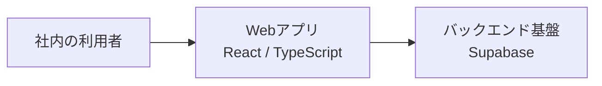

# 技術構成と公開範囲

## 技術構成

CRM-ProはReact、TypeScript、Supabaseを用いた社内向けWebアプリケーションです。フロントエンドとバックエンドを連携させ、営業業務に必要な顧客・案件情報を扱う構成です。

## 公開ショーケースに含める情報

- プロジェクトの目的と解決したい課題
- 利用している技術の概要
- 開発時の役割分担と改善の進め方
- 本番UIを参考に再構成した静止画プレビュー（架空の会社名・担当者名・数値を使用）
- 独立して新規作成した汎用TypeScriptサンプル

## 公開しない情報

このリポジトリには、CRM-Pro本体のソースコード、顧客情報、営業記録、社内資料、実際の本番画面キャプチャ、認証情報、APIキー、環境変数、内部URL、詳細な業務ルールやデータ設計を含めません。UIプレビューは本番のレイアウトを参考に新規作成した静止画で、表示する名前・数値は架空です。コード例も、本番実装から切り出したものではありません。
